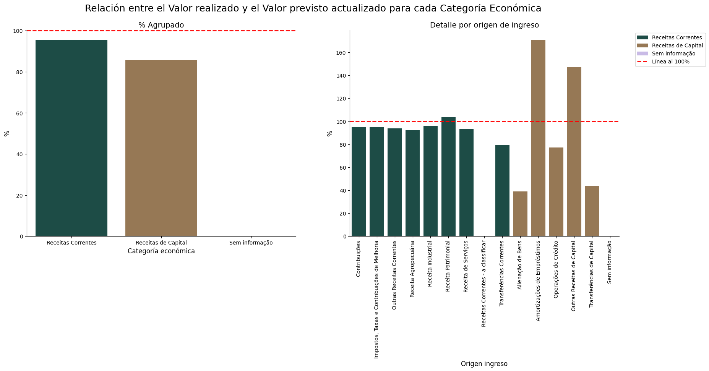
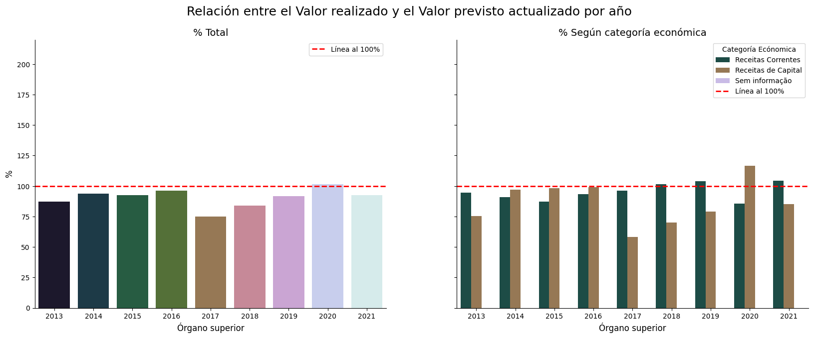
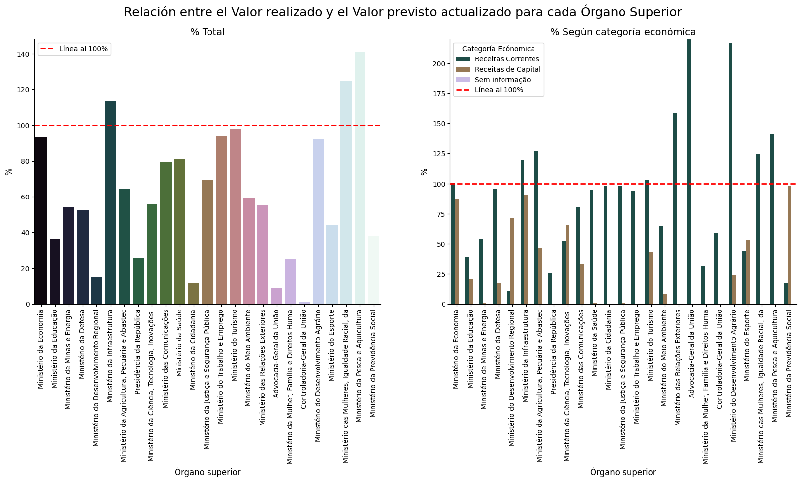
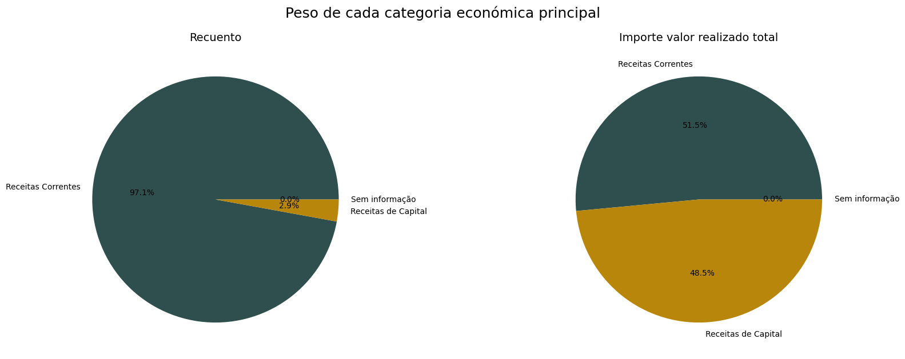
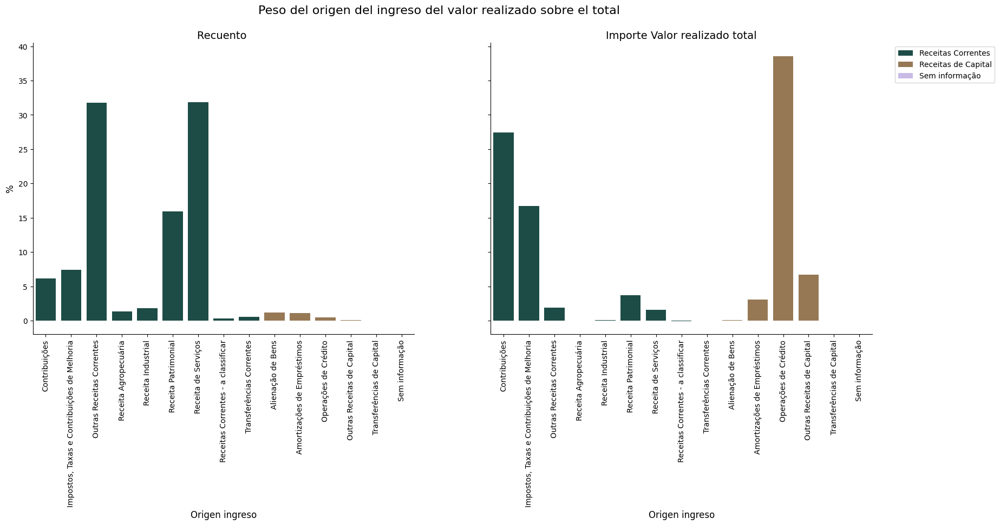
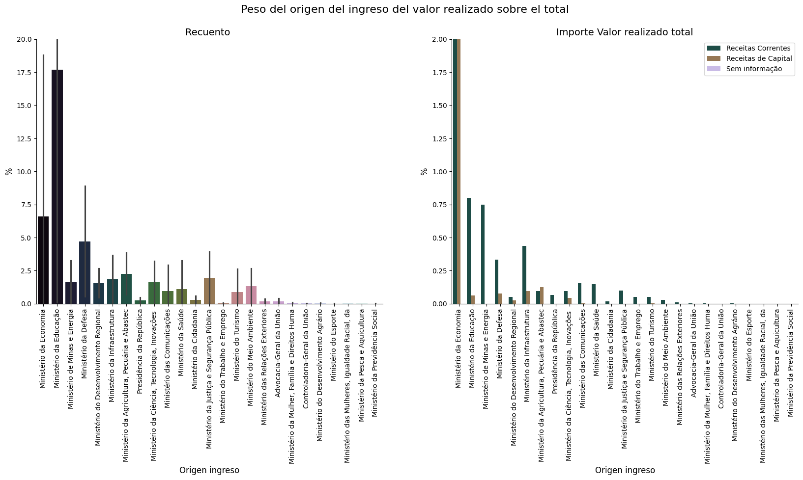

 

 # 📊Análisis Ingresos Publicos Brasil

## Descripción del Proyecto

- Este proyecto realiza un análisis de la recaudación de ingresos públicos del Gobierno de Brasil para financiar los servicios y proyectos que benefician a la sociedad de los datos históricos de la ejecución de ingresos entre 2013 y 2021 con el objetivo de identificar patrones, detectar áreas problemáticas donde la recaudación ha sido consistentemente menor a lo previsto, y proponer recomendaciones basadas en los datos que ayuden a mejorar la precisión de las previsiones y la eficiencia de la recaudación.

- Para llevar a cabo el análisis he realizado un analisis exploratorio de las variables categóricas y númericas para detectar patrones de comportamiento. 

## 🗂️ Estructura del Proyecto

1. **datos/**     ➡️                   *Datos crudos y procesados*

2. **notebooks/**           ➡️                  *Notebooks de Jupyter con el análisis, visualizaciones y conclusiones*

3. **src/**     ➡️               *Scripts de procesamiento y modelado

4. **README.md**    ➡️         *Descripción del proyecto*

    

## 🛠️ Instalación y Requisitos

- Este proyecto usa Python 3.12 y requiere las siguientes bibliotecas:

    - pandas
    - numpy
    - matplotlib
    - seaborn

## 📊 Resultados y Conclusiones

   - Categorías, períodos y órganos superiores con mayor discrepancia entre lo previsto y lo realizado:
      - Las categorías con más discrepancia entre los previsto y lo realizado son las de Ingresos de Capital en concreto, las que proceden de Amortizaciones de préstamos y de Otras rentas de capital, con una super ejecución y enajenaciones de activos y Transferencias de capital con una subejecución elevado.
      
      - En cuanto a los periodos, la mayoría de años tienen una subejecución, aunque bastantes cercanos al 100%. Solo el año 2020 está por encima del 100%, es decir, se recaudó más de lo previsto, y el año 2017 fué el que más lejos se quedó de lo estimado, con una relación por debajo del 75%.
      
      - Por último, el Órgano Superior que más desviación tiene entre lo previsto y lo recaudado es el Controlador General de la Unión y el que más cercano está a lo previsto es el Ministerio de Turismo. La mayoria de Órganos superiores tienen un exceso de estimación, solo en 3 ministerios el valor recaudado es superior al estimado: el Ministerio de Infraestructura, el de Mujeres e Igualdad racial, y el de Pesca y Agricultura.
      

   - Tendencias observadas en la ejecución de ingresos:
      - Los ingresos corrientes representan un 97,1% de los registros que se hacen del valor realizado, representando los ingresos de capital solo un 2,9% de los registros realizados. Sin embargo, en relación al importe recaudado, este 2,9% representa un 48,5% del valor recaudado total. Esto se debe a que los registros de ingresos de capital tienen una media muy superior a los ingresos corrientes. Por tanto, cualquier desviación en la estimación de los ingresos de capital afectan significativamente en las desviaciones totales.
      
         - En los ingresos corrientes, las que más peso tienen en la recaudación son las contribuciones y los impuestos, tasas y contribuciones de mejora.
         - En los ingresos de capital, las que más peso tienen, con diferencia, son las operaciones de crétido, que representan casi el 40% del total recaudado, a pesar que no llega ni al 2% de los registros realizados. 
      
      - En cuanto al órgano superior encargado de la recaudación, el ministerio de economía recauda casi el 50% del total del valor realizado, siendo el que menos recuada el Ministerio de Seguridad Social. Asímismo, el que más registros realiza es el ministerio de educación, siendo el segundo ministerio con mayor recaudación.
      

NOTA: Para profundizar más en los resultados ver el notebook [12_visualizaciones](/notebooks/12_visualizaciones.ipynb).

## 🔄 Próximos Pasos

   - Los registros de las previsiones se realizan en enero y abril en su gran mayoría y se hacen registros por importes muy elevados, por lo que, para mejorar la precisión, sería conveniente ir registrando las previsiones de forma mensual, de este modo podríamos ver en qué mes existe más variación entre lo previsto y lo registrado y además, al ir analizando la variación entre el año anterior y el actual se puede ir afinando los meses posteriores, permitiendonos hacer una estimación más adecuada.

## 🤝 Contribuciones

   -  Las contribuciones son bienvenidas. Si deseas mejorar el proyecto, por favor abre un pull request o una issue, envía un correo a vanesafloresrivera87@gmail.com o contáctame través de [linkedin](https://www.linkedin.com/in/vanesa-flores-rivera/).

## ✒️ Autores

   - **Vanesa Flores Rivera**: [linkedin](https://www.linkedin.com/in/vanesa-flores-rivera/), [github](https://github.com/VanesaFloresRivera)

